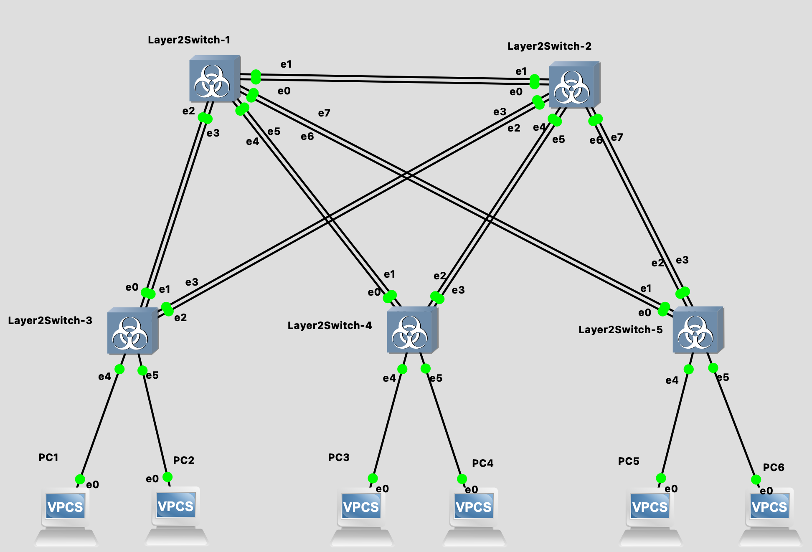
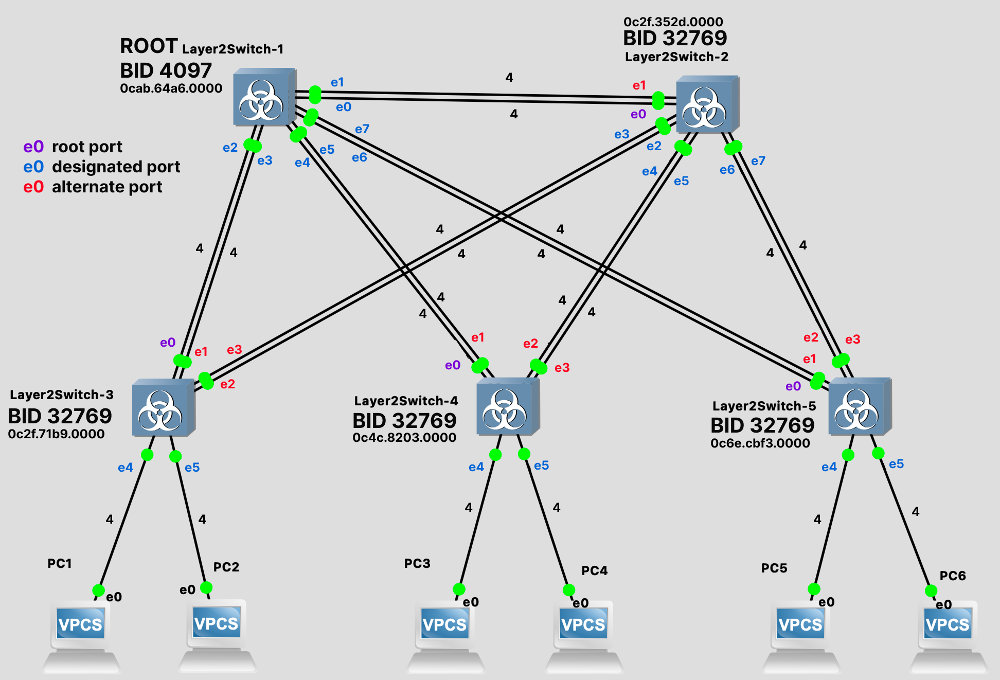
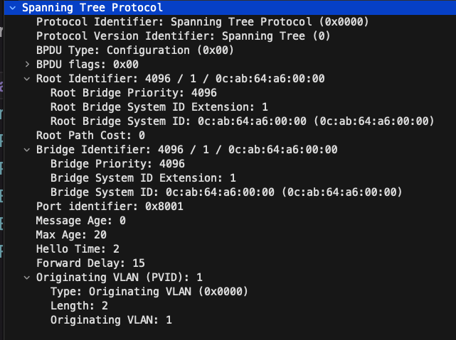
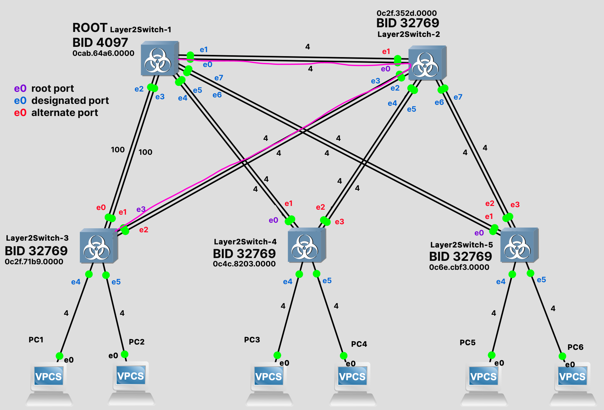

# Лабораторная работа №2: Настройка протокола STP (IEEE 802.1D)

## Сикаченко Дмитрий Константинович

## Цель работы

Настройка протокола Spanning Tree Protocol (STP, IEEE 802.1D) на коммутаторах Cisco IOSv-L2, выбор корневого коммутатора путем изменения приоритета, проверка связности сети между всеми узлами VPCS, фиксация топологии и состояний портов, анализ BPDU пакетов в Wireshark и исследование перестроения топологии при изменении стоимости маршрута.

---

## 1. Топология сети и назначение корневого коммутатора (Root Bridge)

Исходная топология сети состоит из 5 коммутаторов Cisco (S1–S5) и 6 персональных компьютеров (PC1–PC6), находящихся в общей подсети `192.168.1.0/24` (VLAN 1).



---

### Назначение S1 корневым коммутатором

По умолчанию на всех коммутаторах установлен приоритет `32768` (с учетом расширенного системного номера VLAN 1 — `32769`). Для гарантированного назначения коммутатора **S1** (Layer2Switch-1) в качестве корневого моста (Root Bridge) для VLAN 1 устанавливается пониженный приоритет `4096`:

```text
S1> enable
S1# configure terminal
S1(config)# hostname S1
S1(config)# spanning-tree vlan 1 priority 4096
S1(config)# exit
S1# write
```

### Проверка статуса STP на корневом коммутаторе S1

```text
S1# show spanning-tree vlan 1

VLAN0001
  Spanning tree enabled protocol ieee
  Root ID    Priority    4097
             Address     0cab.64a6.0000
             This bridge is the root
             Hello Time   2 sec  Max Age 20 sec  Forward Delay 15 sec

  Bridge ID  Priority    4097   (priority 4096 sys-id-ext 1)
             Address     0cab.64a6.0000
             Hello Time   2 sec  Max Age 20 sec  Forward Delay 15 sec
             Aging Time  300 sec

Interface           Role Sts Cost      Prio.Nbr Type
------------------- ---- --- --------- -------- --------------------------------
Gi0/0               Desg FWD 4         128.1    Shr
Gi0/1               Desg FWD 4         128.2    Shr
Gi0/2               Desg FWD 4         128.3    Shr
Gi0/3               Desg FWD 4         128.4    Shr
Gi1/0               Desg FWD 4         128.5    Shr
Gi1/1               Desg FWD 4         128.6    Shr
Gi1/2               Desg FWD 4         128.7    Shr
Gi1/3               Desg FWD 4         128.8    Shr
Gi2/0               Desg FWD 4         128.9    Shr
```

*Вывод:* Коммутатор S1 стал корневым (`This bridge is the root`), все его порты перешли в состояние **Designated Forwarding (Desg FWD)** со стоимостью 4 (GigabitEthernet).

---

## 2. Проверка связности всех хостов

Адресация хостов:

- **PC1:** 192.168.1.10/24
- **PC2:** 192.168.1.20/24
- **PC3:** 192.168.1.30/24
- **PC4:** 192.168.1.40/24
- **PC5:** 192.168.1.50/24
- **PC6:** 192.168.1.60/24

### Проверка с PC1 (192.168.1.10)

```text
PC1> ping 192.168.1.20
84 bytes from 192.168.1.20 icmp_seq=1 ttl=64 time=2.005 ms
84 bytes from 192.168.1.20 icmp_seq=2 ttl=64 time=1.251 ms
84 bytes from 192.168.1.20 icmp_seq=3 ttl=64 time=2.323 ms

PC1> ping 192.168.1.30
84 bytes from 192.168.1.30 icmp_seq=1 ttl=64 time=16.422 ms
84 bytes from 192.168.1.30 icmp_seq=2 ttl=64 time=7.116 ms
84 bytes from 192.168.1.30 icmp_seq=3 ttl=64 time=12.599 ms

PC1> ping 192.168.1.40
84 bytes from 192.168.1.40 icmp_seq=1 ttl=64 time=14.360 ms
84 bytes from 192.168.1.40 icmp_seq=2 ttl=64 time=16.545 ms
84 bytes from 192.168.1.40 icmp_seq=3 ttl=64 time=10.929 ms

PC1> ping 192.168.1.50
84 bytes from 192.168.1.50 icmp_seq=1 ttl=64 time=13.412 ms
84 bytes from 192.168.1.50 icmp_seq=2 ttl=64 time=14.834 ms
84 bytes from 192.168.1.50 icmp_seq=3 ttl=64 time=9.433 ms

PC1> ping 192.168.1.60
84 bytes from 192.168.1.60 icmp_seq=1 ttl=64 time=18.527 ms
84 bytes from 192.168.1.60 icmp_seq=2 ttl=64 time=18.583 ms
84 bytes from 192.168.1.60 icmp_seq=3 ttl=64 time=13.352 ms
```

### Проверка с PC2 (192.168.1.20)

```text
PC2> ping 192.168.1.10
84 bytes from 192.168.1.10 icmp_seq=1 ttl=64 time=6.458 ms
84 bytes from 192.168.1.10 icmp_seq=2 ttl=64 time=3.235 ms
84 bytes from 192.168.1.10 icmp_seq=3 ttl=64 time=7.633 ms

PC2> ping 192.168.1.30
84 bytes from 192.168.1.30 icmp_seq=1 ttl=64 time=15.452 ms
84 bytes from 192.168.1.30 icmp_seq=2 ttl=64 time=6.935 ms
84 bytes from 192.168.1.30 icmp_seq=3 ttl=64 time=6.392 ms

PC2> ping 192.168.1.40
84 bytes from 192.168.1.40 icmp_seq=1 ttl=64 time=17.209 ms
84 bytes from 192.168.1.40 icmp_seq=2 ttl=64 time=6.116 ms
84 bytes from 192.168.1.40 icmp_seq=3 ttl=64 time=8.005 ms

PC2> ping 192.168.1.50
84 bytes from 192.168.1.50 icmp_seq=1 ttl=64 time=8.879 ms
84 bytes from 192.168.1.50 icmp_seq=2 ttl=64 time=10.382 ms
84 bytes from 192.168.1.50 icmp_seq=3 ttl=64 time=18.619 ms

PC2> ping 192.168.1.60
84 bytes from 192.168.1.60 icmp_seq=1 ttl=64 time=15.042 ms
84 bytes from 192.168.1.60 icmp_seq=2 ttl=64 time=12.542 ms
84 bytes from 192.168.1.60 icmp_seq=3 ttl=64 time=4.868 ms
```

### Проверка с PC3 (192.168.1.30)

```text
PC3> ping 192.168.1.10
84 bytes from 192.168.1.10 icmp_seq=1 ttl=64 time=13.901 ms
84 bytes from 192.168.1.10 icmp_seq=2 ttl=64 time=11.006 ms
84 bytes from 192.168.1.10 icmp_seq=3 ttl=64 time=14.914 ms

PC3> ping 192.168.1.20
84 bytes from 192.168.1.20 icmp_seq=1 ttl=64 time=17.163 ms
84 bytes from 192.168.1.20 icmp_seq=2 ttl=64 time=8.426 ms
84 bytes from 192.168.1.20 icmp_seq=3 ttl=64 time=15.545 ms

PC3> ping 192.168.1.40
84 bytes from 192.168.1.40 icmp_seq=1 ttl=64 time=11.251 ms
84 bytes from 192.168.1.40 icmp_seq=2 ttl=64 time=2.198 ms
84 bytes from 192.168.1.40 icmp_seq=3 ttl=64 time=1.249 ms

PC3> ping 192.168.1.50
84 bytes from 192.168.1.50 icmp_seq=1 ttl=64 time=9.035 ms
84 bytes from 192.168.1.50 icmp_seq=2 ttl=64 time=21.730 ms
84 bytes from 192.168.1.50 icmp_seq=3 ttl=64 time=19.495 ms

PC3> ping 192.168.1.60
84 bytes from 192.168.1.60 icmp_seq=1 ttl=64 time=18.699 ms
84 bytes from 192.168.1.60 icmp_seq=2 ttl=64 time=19.154 ms
84 bytes from 192.168.1.60 icmp_seq=3 ttl=64 time=14.048 ms
```

### Проверка с PC4 (192.168.1.40)

```text
PC4> ping 192.168.1.10
84 bytes from 192.168.1.10 icmp_seq=1 ttl=64 time=13.019 ms
84 bytes from 192.168.1.10 icmp_seq=2 ttl=64 time=14.652 ms
84 bytes from 192.168.1.10 icmp_seq=3 ttl=64 time=8.878 ms

PC4> ping 192.168.1.20
84 bytes from 192.168.1.20 icmp_seq=1 ttl=64 time=14.397 ms
84 bytes from 192.168.1.20 icmp_seq=2 ttl=64 time=10.030 ms
84 bytes from 192.168.1.20 icmp_seq=3 ttl=64 time=15.969 ms

PC4> ping 192.168.1.30
84 bytes from 192.168.1.30 icmp_seq=1 ttl=64 time=6.871 ms
84 bytes from 192.168.1.30 icmp_seq=2 ttl=64 time=5.015 ms
84 bytes from 192.168.1.30 icmp_seq=3 ttl=64 time=6.134 ms

PC4> ping 192.168.1.50
84 bytes from 192.168.1.50 icmp_seq=1 ttl=64 time=11.180 ms
84 bytes from 192.168.1.50 icmp_seq=2 ttl=64 time=20.376 ms
84 bytes from 192.168.1.50 icmp_seq=3 ttl=64 time=9.115 ms

PC4> ping 192.168.1.60
84 bytes from 192.168.1.60 icmp_seq=1 ttl=64 time=10.915 ms
84 bytes from 192.168.1.60 icmp_seq=2 ttl=64 time=14.750 ms
84 bytes from 192.168.1.60 icmp_seq=3 ttl=64 time=16.990 ms
```

### Проверка с PC5 (192.168.1.50)

```text
PC5> ping 192.168.1.10
84 bytes from 192.168.1.10 icmp_seq=1 ttl=64 time=11.443 ms
84 bytes from 192.168.1.10 icmp_seq=2 ttl=64 time=15.574 ms
84 bytes from 192.168.1.10 icmp_seq=3 ttl=64 time=11.321 ms

PC5> ping 192.168.1.20
84 bytes from 192.168.1.20 icmp_seq=1 ttl=64 time=12.768 ms
84 bytes from 192.168.1.20 icmp_seq=2 ttl=64 time=4.088 ms
84 bytes from 192.168.1.20 icmp_seq=3 ttl=64 time=8.060 ms

PC5> ping 192.168.1.30
84 bytes from 192.168.1.30 icmp_seq=1 ttl=64 time=20.640 ms
84 bytes from 192.168.1.30 icmp_seq=2 ttl=64 time=9.334 ms
84 bytes from 192.168.1.30 icmp_seq=3 ttl=64 time=13.187 ms

PC5> ping 192.168.1.40
84 bytes from 192.168.1.40 icmp_seq=1 ttl=64 time=27.711 ms
84 bytes from 192.168.1.40 icmp_seq=2 ttl=64 time=12.030 ms
84 bytes from 192.168.1.40 icmp_seq=3 ttl=64 time=18.373 ms

PC5> ping 192.168.1.60
84 bytes from 192.168.1.60 icmp_seq=1 ttl=64 time=4.325 ms
84 bytes from 192.168.1.60 icmp_seq=2 ttl=64 time=3.562 ms
84 bytes from 192.168.1.60 icmp_seq=3 ttl=64 time=5.551 ms
```

### Проверка с PC6 (192.168.1.60)

```text
PC6> ping 192.168.1.10
84 bytes from 192.168.1.10 icmp_seq=1 ttl=64 time=17.679 ms
84 bytes from 192.168.1.10 icmp_seq=2 ttl=64 time=5.835 ms
84 bytes from 192.168.1.10 icmp_seq=3 ttl=64 time=6.715 ms

PC6> ping 192.168.1.20
84 bytes from 192.168.1.20 icmp_seq=1 ttl=64 time=14.759 ms
84 bytes from 192.168.1.20 icmp_seq=2 ttl=64 time=2.747 ms
84 bytes from 192.168.1.20 icmp_seq=3 ttl=64 time=17.332 ms

PC6> ping 192.168.1.30
84 bytes from 192.168.1.30 icmp_seq=1 ttl=64 time=7.081 ms
84 bytes from 192.168.1.30 icmp_seq=2 ttl=64 time=11.222 ms
84 bytes from 192.168.1.30 icmp_seq=3 ttl=64 time=11.572 ms

PC6> ping 192.168.1.40
84 bytes from 192.168.1.40 icmp_seq=1 ttl=64 time=6.296 ms
84 bytes from 192.168.1.40 icmp_seq=2 ttl=64 time=26.872 ms
84 bytes from 192.168.1.40 icmp_seq=3 ttl=64 time=12.114 ms

PC6> ping 192.168.1.50
84 bytes from 192.168.1.50 icmp_seq=1 ttl=64 time=6.743 ms
84 bytes from 192.168.1.50 icmp_seq=2 ttl=64 time=3.063 ms
84 bytes from 192.168.1.50 icmp_seq=3 ttl=64 time=3.188 ms
```

*Результат:* Все узлы имеют 100% связность.

---

## 3. Таблица BID и состояний портов коммутаторов



---

## 4. Захват Hello BPDU через Wireshark со всех линков Root Bridge

Layer2Switch-1_Ethernet0_to_Layer2Switch-2_Ethernet0



```bash
Spanning Tree Protocol
    Protocol Identifier: Spanning Tree Protocol (0x0000)
    Protocol Version Identifier: Spanning Tree (0)
    BPDU Type: Configuration (0x00) <- Сам Hello BPDU
    BPDU flags: 0x00
    Root Identifier: 4096 / 1 / 0c:ab:64:a6:00:00
        Root Bridge Priority: 4096
        Root Bridge System ID Extension: 1
        Root Bridge System ID: 0c:ab:64:a6:00:00 (0c:ab:64:a6:00:00)
    Root Path Cost: 0 <- Стоимость 0 потому, что это и так корневой свитч
    Bridge Identifier: 4096 / 1 / 0c:ab:64:a6:00:00
        Bridge Priority: 4096
        Bridge System ID Extension: 1
        Bridge System ID: 0c:ab:64:a6:00:00 (0c:ab:64:a6:00:00)
    Port identifier: 0x8001 <- Порт, с которого S1 отправил пакет
    Message Age: 0
    Max Age: 20
    Hello Time: 2 <- Интервал отправки Hello BPDU
    Forward Delay: 15
    Originating VLAN (PVID): 1
        Type: Originating VLAN (0x0000)
        Length: 2
        Originating VLAN: 1

```

Layer2Switch-1_Ethernet1_to_Layer2Switch-2_Ethernet1

```bash
Spanning Tree Protocol
    Protocol Identifier: Spanning Tree Protocol (0x0000)
    Protocol Version Identifier: Spanning Tree (0)
    BPDU Type: Configuration (0x00)
    BPDU flags: 0x00
    Root Identifier: 4096 / 1 / 0c:ab:64:a6:00:00
        Root Bridge Priority: 4096
        Root Bridge System ID Extension: 1
        Root Bridge System ID: 0c:ab:64:a6:00:00 (0c:ab:64:a6:00:00)
    Root Path Cost: 0
    Bridge Identifier: 4096 / 1 / 0c:ab:64:a6:00:00
        Bridge Priority: 4096
        Bridge System ID Extension: 1
        Bridge System ID: 0c:ab:64:a6:00:00 (0c:ab:64:a6:00:00)
    Port identifier: 0x8002
    Message Age: 0
    Max Age: 20
    Hello Time: 2
    Forward Delay: 15
    Originating VLAN (PVID): 1
        Type: Originating VLAN (0x0000)
        Length: 2
        Originating VLAN: 1

```

Layer2Switch-1_Ethernet2_to_Layer2Switch-3_Ethernet0

```bash
Spanning Tree Protocol
    Protocol Identifier: Spanning Tree Protocol (0x0000)
    Protocol Version Identifier: Spanning Tree (0)
    BPDU Type: Configuration (0x00)
    BPDU flags: 0x00
    Root Identifier: 4096 / 1 / 0c:ab:64:a6:00:00
        Root Bridge Priority: 4096
        Root Bridge System ID Extension: 1
        Root Bridge System ID: 0c:ab:64:a6:00:00 (0c:ab:64:a6:00:00)
    Root Path Cost: 0
    Bridge Identifier: 4096 / 1 / 0c:ab:64:a6:00:00
        Bridge Priority: 4096
        Bridge System ID Extension: 1
        Bridge System ID: 0c:ab:64:a6:00:00 (0c:ab:64:a6:00:00)
    Port identifier: 0x8003
    Message Age: 0
    Max Age: 20
    Hello Time: 2
    Forward Delay: 15
    Originating VLAN (PVID): 1
        Type: Originating VLAN (0x0000)
        Length: 2
        Originating VLAN: 1

```

Layer2Switch-1_Ethernet3_to_Layer2Switch-3_Ethernet1

```bash
Spanning Tree Protocol
    Protocol Identifier: Spanning Tree Protocol (0x0000)
    Protocol Version Identifier: Spanning Tree (0)
    BPDU Type: Configuration (0x00)
    BPDU flags: 0x00
    Root Identifier: 4096 / 1 / 0c:ab:64:a6:00:00
        Root Bridge Priority: 4096
        Root Bridge System ID Extension: 1
        Root Bridge System ID: 0c:ab:64:a6:00:00 (0c:ab:64:a6:00:00)
    Root Path Cost: 0
    Bridge Identifier: 4096 / 1 / 0c:ab:64:a6:00:00
        Bridge Priority: 4096
        Bridge System ID Extension: 1
        Bridge System ID: 0c:ab:64:a6:00:00 (0c:ab:64:a6:00:00)
    Port identifier: 0x8004
    Message Age: 0
    Max Age: 20
    Hello Time: 2
    Forward Delay: 15
    Originating VLAN (PVID): 1
        Type: Originating VLAN (0x0000)
        Length: 2
        Originating VLAN: 1

```

Layer2Switch-1_Ethernet4_to_Layer2Switch-4_Ethernet0

```bash
Spanning Tree Protocol
    Protocol Identifier: Spanning Tree Protocol (0x0000)
    Protocol Version Identifier: Spanning Tree (0)
    BPDU Type: Configuration (0x00)
    BPDU flags: 0x00
    Root Identifier: 4096 / 1 / 0c:ab:64:a6:00:00
        Root Bridge Priority: 4096
        Root Bridge System ID Extension: 1
        Root Bridge System ID: 0c:ab:64:a6:00:00 (0c:ab:64:a6:00:00)
    Root Path Cost: 0
    Bridge Identifier: 4096 / 1 / 0c:ab:64:a6:00:00
        Bridge Priority: 4096
        Bridge System ID Extension: 1
        Bridge System ID: 0c:ab:64:a6:00:00 (0c:ab:64:a6:00:00)
    Port identifier: 0x8005
    Message Age: 0
    Max Age: 20
    Hello Time: 2
    Forward Delay: 15
    Originating VLAN (PVID): 1

```

Layer2Switch-1_Ethernet5_to_Layer2Switch-4_Ethernet1

```bash
Spanning Tree Protocol
    Protocol Identifier: Spanning Tree Protocol (0x0000)
    Protocol Version Identifier: Spanning Tree (0)
    BPDU Type: Configuration (0x00)
    BPDU flags: 0x00
    Root Identifier: 4096 / 1 / 0c:ab:64:a6:00:00
        Root Bridge Priority: 4096
        Root Bridge System ID Extension: 1
        Root Bridge System ID: 0c:ab:64:a6:00:00 (0c:ab:64:a6:00:00)
    Root Path Cost: 0
    Bridge Identifier: 4096 / 1 / 0c:ab:64:a6:00:00
        Bridge Priority: 4096
        Bridge System ID Extension: 1
        Bridge System ID: 0c:ab:64:a6:00:00 (0c:ab:64:a6:00:00)
    Port identifier: 0x8006
    Message Age: 0
    Max Age: 20
    Hello Time: 2
    Forward Delay: 15
    Originating VLAN (PVID): 1

```

Layer2Switch-1_Ethernet6_to_Layer2Switch-5_Ethernet0

```bash
Spanning Tree Protocol
    Protocol Identifier: Spanning Tree Protocol (0x0000)
    Protocol Version Identifier: Spanning Tree (0)
    BPDU Type: Configuration (0x00)
    BPDU flags: 0x00
    Root Identifier: 4096 / 1 / 0c:ab:64:a6:00:00
        Root Bridge Priority: 4096
        Root Bridge System ID Extension: 1
        Root Bridge System ID: 0c:ab:64:a6:00:00 (0c:ab:64:a6:00:00)
    Root Path Cost: 0
    Bridge Identifier: 4096 / 1 / 0c:ab:64:a6:00:00
        Bridge Priority: 4096
        Bridge System ID Extension: 1
        Bridge System ID: 0c:ab:64:a6:00:00 (0c:ab:64:a6:00:00)
    Port identifier: 0x8007
    Message Age: 0
    Max Age: 20
    Hello Time: 2
    Forward Delay: 15
    Originating VLAN (PVID): 1

```

Layer2Switch-1_Ethernet7_to_Layer2Switch-5_Ethernet1

```bash
Spanning Tree Protocol
    Protocol Identifier: Spanning Tree Protocol (0x0000)
    Protocol Version Identifier: Spanning Tree (0)
    BPDU Type: Configuration (0x00)
    BPDU flags: 0x00
    Root Identifier: 24576 / 100 / 0c:ab:64:a6:00:00
        Root Bridge Priority: 24576
        Root Bridge System ID Extension: 100
        Root Bridge System ID: 0c:ab:64:a6:00:00 (0c:ab:64:a6:00:00)
    Root Path Cost: 0
    Bridge Identifier: 24576 / 100 / 0c:ab:64:a6:00:00
        Bridge Priority: 24576
        Bridge System ID Extension: 100
        Bridge System ID: 0c:ab:64:a6:00:00 (0c:ab:64:a6:00:00)
    Port identifier: 0x8008
    Message Age: 0
    Max Age: 20
    Hello Time: 2
    Forward Delay: 15
    Originating VLAN (PVID): 100
        Type: Originating VLAN (0x0000)
        Length: 2
        Originating VLAN: 100

```

---

## 6. Изменение стоимости Root Port у некорневого коммутатора

Сделаю стоимость пути через корневой порт у S3 равной 100:

```bash
S3#configure terminal
S3(config)#interface gigabitEthernet 0/0
S3(config-if)#spanning-tree vlan 1 cost 100
S3(config-if)#end
S3#show spanning-tree vlan 1

VLAN0001
  Spanning tree enabled protocol ieee
  Root ID    Priority    4097
             Address     0cab.64a6.0000
             Cost        4
             Port        2 (GigabitEthernet0/1)
             Hello Time   2 sec  Max Age 20 sec  Forward Delay 15 sec

  Bridge ID  Priority    32769  (priority 32768 sys-id-ext 1)
             Address     0c2f.71b9.0000
             Hello Time   2 sec  Max Age 20 sec  Forward Delay 15 sec
             Aging Time  15  sec

Interface           Role Sts Cost      Prio.Nbr Type
------------------- ---- --- --------- -------- --------------------------------
Gi0/0               Altn BLK 100       128.1    Shr
Gi0/1               Root LIS 4         128.2    Shr
Gi0/2               Altn BLK 4         128.3    Shr
Gi0/3               Altn BLK 4         128.4    Shr
Gi1/0               Desg FWD 4         128.5    Shr
Gi1/1               Desg FWD 4         128.6    Shr
```

После смены Root Port состояние порта становится LIS (listening), через 15 секунд оно станет LRN (learning), через ещё 15 секунд будет FWD (forwarding).

```bash
Gi0/1               Root FWD 4         128.2    Shr
```

В этом примере связь между S3 и S1 всё ещё прямая, поэтому Root Path Cost равен 4.

Заблокирую второй порт до S1, чтобы трафик шёл с S3 до S1 через S2:

```bash
S3#configure terminal
S3(config)#interface gigabitEthernet 0/1
S3(config-if)#spanning-tree vlan 1 cost 100
S3(config-if)#end
S3#show spanning-tree vlan 1

VLAN0001
  Spanning tree enabled protocol ieee
  Root ID    Priority    4097
             Address     0cab.64a6.0000
             Cost        8
             Port        3 (GigabitEthernet0/2)
             Hello Time   2 sec  Max Age 20 sec  Forward Delay 15 sec

  Bridge ID  Priority    32769  (priority 32768 sys-id-ext 1)
             Address     0c2f.71b9.0000
             Hello Time   2 sec  Max Age 20 sec  Forward Delay 15 sec
             Aging Time  15  sec

Interface           Role Sts Cost      Prio.Nbr Type
------------------- ---- --- --------- -------- --------------------------------
Gi0/0               Altn BLK 100       128.1    Shr
Gi0/1               Altn BLK 100       128.2    Shr
Gi0/2               Root FWD 4         128.3    Shr
Gi0/3               Altn BLK 4         128.4    Shr
Gi1/0               Desg FWD 4         128.5    Shr
Gi1/1               Desg FWD 4         128.6    Shr
```

Теперь Cost равен 8, оба порта в S1 заблокированы, путь трафика изменился и проходит через S2.



---

## 6. Конфигурации

Сохранены по пути `./configs`

---

## 7. Разница STP и RSTP

RSTP сохраняет ту же логику выбора Root Bridge и ролей портов, что и STP, но устраняет фиксированные таймеры ожидания, заменяя их активным согласованием между соседними коммутаторами, что сокращает время восстановления сети с 30–50 секунд до 1–2 секунд.
