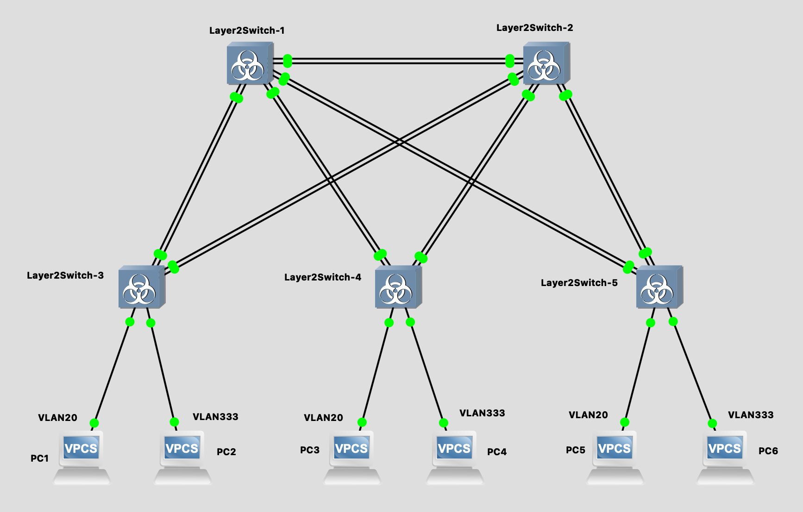
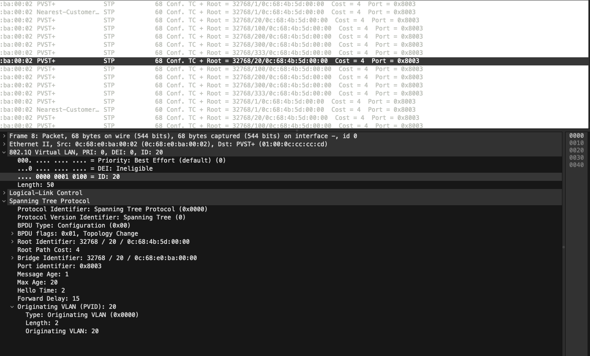
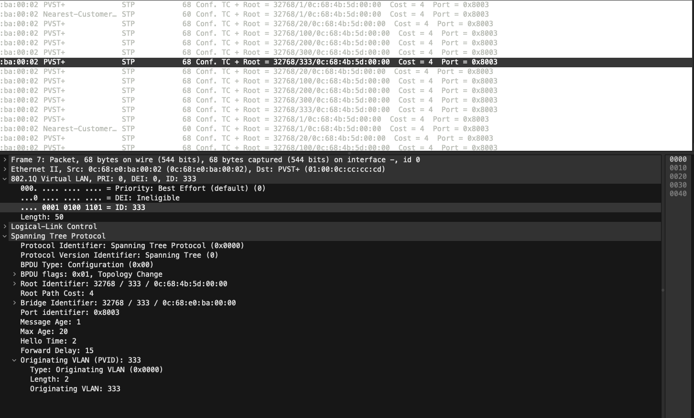
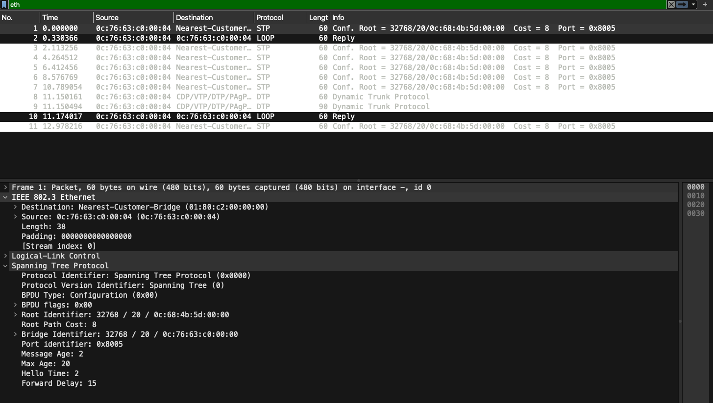
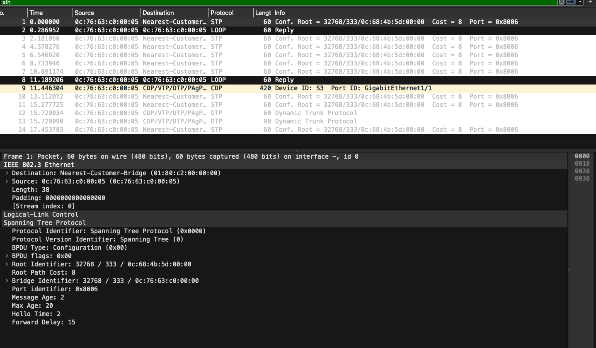
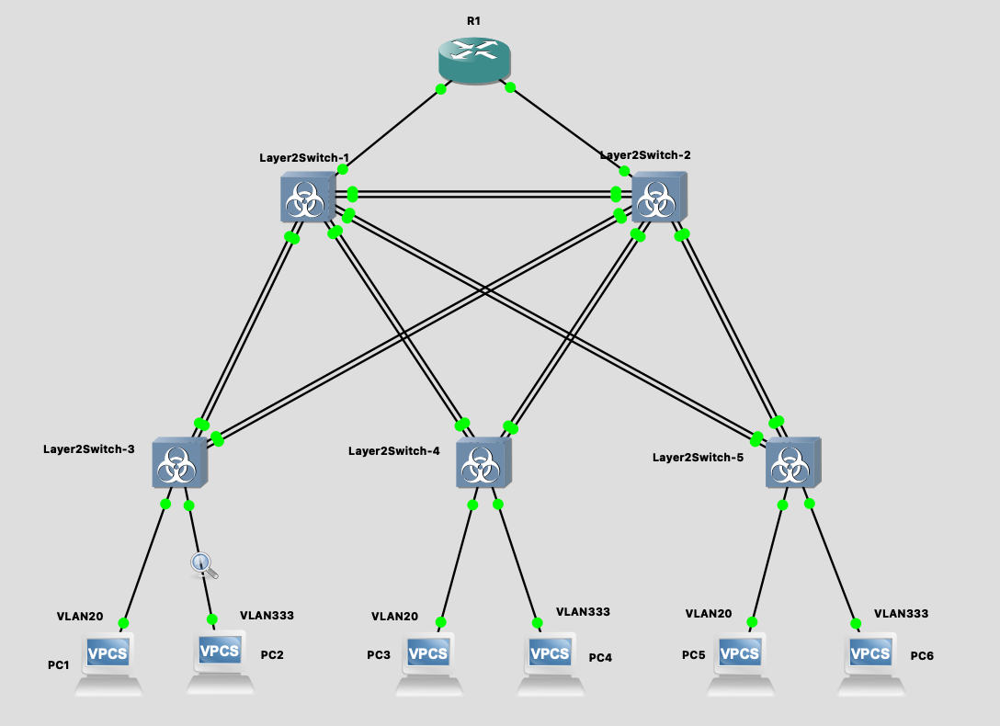

# Лабораторная работа №3: Настройка виртуальной локальной сети (VLAN)

## Сикаченко Дмитрий Константинович

Топология



---

## 1. Для заданной на схеме schema-lab3 сети, состоящей из управляемых коммутаторов и персональных компьютеров настроить на коммутаторах логическую топологию используя протокол IEEE 802.1Q, для передачи пакетов VLAN333 между коммутаторами использовать Native VLAN

### S1

```bash
S1>enable
S1#config terminal
S1(config)#vlan 20
S1(config-vlan)#name VLAN20
S1(config-vlan)#exit
S1(config)#vlan 333
S1(config-vlan)#name VLAN333
S1(config-vlan)#exit

S1(config)#interface gigabitEthernet 0/0
S1(config-if)#switchport trunk encapsulation dot1q
S1(config-if)#switchport mode trunk
S1(config-if)#exit

S1(config)#interface gigabitEthernet 0/1
S1(config-if)#switchport trunk encapsulation dot1q
S1(config-if)#switchport mode trunk
S1(config-if)#exit

S1(config)#interface gigabitEthernet 0/3
S1(config-if)#switchport trunk encapsulation dot1q
S1(config-if)#switchport mode trunk
S1(config-if)#exit

S1(config)#interface range gigabitEthernet 0/0 - 3 , gigabitEthernet 1/0 - 3
S1(config-if-range)#switchport trunk native vlan 333

S1(config)#exit
S1(config)#write
```

```bash
S1#show interfaces status

Port      Name               Status       Vlan       Duplex  Speed Type
Gi0/0                        connected    trunk        auto   auto unknown
Gi0/1                        connected    trunk        auto   auto unknown
Gi0/2                        connected    trunk        auto   auto unknown
Gi0/3                        connected    trunk        auto   auto unknown
Gi1/0                        connected    trunk        auto   auto unknown
Gi1/1                        connected    trunk        auto   auto unknown
Gi1/2                        connected    trunk        auto   auto unknown
Gi1/3                        connected    trunk        auto   auto unknown
Gi2/0                        notconnect   1            auto   auto unknown
```

```bash
show interfaces trunk

Port        Mode             Encapsulation  Status        Native vlan
Gi0/0       on               802.1q         trunking      333
Gi0/1       desirable        n-isl          trunking      333
Gi0/2       on               802.1q         trunking      333
Gi0/3       desirable        n-802.1q       trunking      333
Gi1/0       on               802.1q         trunking      333
Gi1/1       desirable        n-isl          trunking      333
Gi1/2       desirable        n-isl          trunking      333
Gi1/3       desirable        n-isl          trunking      333
```

### S2

```bash
enable
config t
vlan 20
name VLAN20
exit
vlan 333
name VLAN333
exit

interface gigabitEthernet 0/0
switchport trunk encapsulation dot1q
switchport mode trunk
exit

interface gigabitEthernet 1/2
switchport trunk encapsulation dot1q
switchport mode trunk
exit

conf t
interface range gigabitEthernet 0/1 - 3 , gigabitEthernet 1/0 - 3
switchport trunk native vlan 333

exit
write
```

```bash
show interfaces status

Port      Name               Status       Vlan       Duplex  Speed Type
Gi0/0                        connected    trunk        auto   auto unknown
Gi1/2                        connected    trunk        auto   auto unknown
```

```bash
show interfaces trunk

Port        Mode             Encapsulation  Status        Native vlan
Gi0/0       on               802.1q         trunking      333
Gi0/1       desirable        n-isl          trunking      333
Gi0/2       desirable        n-isl          trunking      333
Gi0/3       desirable        n-isl          trunking      333
Gi1/0       desirable        n-isl          trunking      333
Gi1/1       desirable        n-isl          trunking      333
Gi1/2       on               802.1q         trunking      333
Gi1/3       desirable        n-isl          trunking      33
```

### S3

```bash
enable
config t
vlan 20
name VLAN20
exit
vlan 333
name VLAN333
exit

interface gigabitEthernet 0/1
switchport trunk encapsulation dot1q
switchport mode trunk
exit

interface gigabitEthernet 1/0
switchport trunk encapsulation dot1q
switchport mode access
switchport access vlan 20
exit

interface gigabitEthernet 1/1
switchport trunk encapsulation dot1q
switchport mode access
switchport access vlan 333
exit

conf t
interface range gigabitEthernet 0/0 , gigabitEthernet 0/2 - 3
switchport trunk native vlan 333

exit
write
```

```bash
S3#show interfaces status

Port      Name               Status       Vlan       Duplex  Speed Type
Gi0/1                        connected    trunk        auto   auto unknown
Gi1/0                        connected    20           auto   auto unknown
Gi1/1                        connected    333          auto   auto unknown
```

```bash
show interfaces trunk

Port        Mode             Encapsulation  Status        Native vlan
Gi0/0       desirable        n-802.1q       trunking      1
Gi0/1       on               802.1q         trunking      333
Gi0/2       desirable        n-isl          trunking      1
Gi0/3       desirable        n-isl          trunking      1
```

### S4

```bash
enable
config t
vlan 20
name VLAN20
exit
vlan 333
name VLAN333
exit

interface gigabitEthernet 0/1
switchport trunk encapsulation dot1q
switchport mode trunk
exit

interface gigabitEthernet 1/0
switchport trunk encapsulation dot1q
switchport mode access
switchport access vlan 20
exit

interface gigabitEthernet 1/1
switchport trunk encapsulation dot1q
switchport mode access
switchport access vlan 333
exit

conf t
interface range gigabitEthernet 0/0 , gigabitEthernet 0/2 - 3
switchport trunk native vlan 333

exit
write
```

```bash
S3#show interfaces status

Port      Name               Status       Vlan       Duplex  Speed Type
Gi0/1                        connected    trunk        auto   auto unknown
Gi1/0                        connected    20           auto   auto unknown
Gi1/1                        connected    333          auto   auto unknown
```

```bash
show interfaces trunk

Port        Mode             Encapsulation  Status        Native vlan
Gi0/0       on               802.1q         trunking      1
Gi0/1       desirable        n-isl          trunking      333
Gi0/2       desirable        n-isl          trunking      1
Gi0/3       desirable        n-isl          trunking      1
```

### S5

```bash
enable
config t
vlan 20
name VLAN20
exit
vlan 333
name VLAN333
exit

interface gigabitEthernet 0/2
switchport trunk encapsulation dot1q
switchport mode trunk
exit

interface gigabitEthernet 1/0
switchport trunk encapsulation dot1q
switchport mode access
switchport access vlan 20
exit

interface gigabitEthernet 1/1
switchport trunk encapsulation dot1q
switchport mode access
switchport access vlan 333
exit

conf t
interface range gigabitEthernet 0/0 - 1 , gigabitEthernet 0/3
switchport trunk native vlan 333

exit
write
```

```bash
S3#show interfaces status

Port      Name               Status       Vlan       Duplex  Speed Type
Gi0/2                        connected    trunk        auto   auto unknown
Gi1/0                        connected    20           auto   auto unknown
Gi1/1                        connected    333          auto   auto unknown
```

```bash
show interfaces trunk

Port        Mode             Encapsulation  Status        Native vlan
Gi0/0       desirable        n-isl          trunking      1
Gi0/1       desirable        n-isl          trunking      1
Gi0/2       on               802.1q         trunking      333
Gi0/3       desirable        n-isl          trunking      1
```

---

## 2. Проверить доступность персональных компьютеров, находящихся в одинаковых VLAN и недоступность находящихся в различных, результаты задокументировать

Ping PC1 (vlan 20) -> PC2 (vlan 333):

```bash
ping 192.168.12.1

No gateway found
```

Ping PC1 (vlan 20) -> PC3 (vlan 20):

```bash
ping 192.168.11.2

84 bytes from 192.168.11.2 icmp_seq=1 ttl=64 time=18.060 ms
84 bytes from 192.168.11.2 icmp_seq=2 ttl=64 time=16.458 ms
84 bytes from 192.168.11.2 icmp_seq=3 ttl=64 time=11.082 ms
```

Ping PC2 (vlan 333) -> PC4 (vlan 333):

```bash
ping 192.168.12.2

84 bytes from 192.168.12.2 icmp_seq=1 ttl=64 time=14.326 ms
84 bytes from 192.168.12.2 icmp_seq=2 ttl=64 time=12.563 ms
84 bytes from 192.168.12.2 icmp_seq=3 ttl=64 time=23.899 ms
```

Ping PC2 (vlan 333) -> PC1 (vlan 20):

```bash
ping 192.168.11.1

No gateway found
```

---

## 3. Перехватить в WireShark пакеты с тегами и без тегов (nb!), результаты задокументировать

Capture link Layer2Switch-1_Ethernet2_to_Layer2Switch-3_Ethernet0

vlan 20



vlan 333



Layer2Switch-3_Ethernet4_to_PC1_Ethernet0

vlan 20


Layer2Switch-3_Ethernet5_to_PC2_Ethernet0

vlan 333


---

## 4) Сохранить файлы конфигураций устройств в виде набора файлов с именами, соответствующими именам устройств

```bash
enable
sh run
```

Файлы конфигураций сохранены в ./configs

---

## 5. Опциональное задание: Добавить в схему маршрутизатор, подключенный к коммутаторам Layer2Switch1 и Layer2Switch2, настроить через него маршрутизацию между VLAN

Топология



---

Подниму интерфейсы роутера

```bash
R1# conf t
R1(config)# interface ethernet 2/0
R1(config-if)# no shutdown
R1(config-if)# end
R1# conf t
R1(config-if)# interface ethernet 2/1
R1(config-if)# no shutdown
R1(config-if)# end
```

```bash
show ip interface brief

Interface                  IP-Address      OK? Method Status                Protocol
FastEthernet0/0            unassigned      YES unset  administratively down down
FastEthernet1/0            unassigned      YES unset  administratively down down
Ethernet2/0                unassigned      YES unset  up                    up
Ethernet2/1                unassigned      YES unset  up                    up
```

```bash
show interfaces status

Interface FastEthernet0/0 is disabled

Interface FastEthernet1/0 is disabled

Ethernet2/0
          Switching path    Pkts In   Chars In   Pkts Out  Chars Out
               Processor         40       2460         13       1876
             Route cache          0          0          0          0
                   Total         40       2460         13       1876
Ethernet2/1
          Switching path    Pkts In   Chars In   Pkts Out  Chars Out
               Processor          6        312          3        728
             Route cache          0          0          0          0
                   Total          6        312          3        728
```

```bash
show cdp neighbors

Capability Codes: R - Router, T - Trans Bridge, B - Source Route Bridge
                  S - Switch, H - Host, I - IGMP, r - Repeater

Device ID        Local Intrfce     Holdtme    Capability  Platform  Port ID
S2               Eth 2/1            175        R S I      IOSv      Gig 2/0
S1               Eth 2/0            138        R S I      IOSv      Gig 2/0
```

Настрою S1 и S2

s1 and s2

```bash
conf t
interface gigabitEthernet 2/0
switchport mode access
switchport access vlan 20
no shutdown
end
write
```

s1

```bash
show interfaces status

...
Gi2/0                        connected    20           auto   auto unknown
```

s2

```bash
show interfaces status

...
Gi2/0                        connected    333          auto   auto unknown
```

Config R1

```bash
conf t
interface Ethernet2/0
ip address 192.168.11.254 255.255.255.0
no shutdown
interface Ethernet2/1
ip address 192.168.12.254 255.255.255.0
no shutdown
end
write
```

```bash
show ip interface brief

Interface                  IP-Address      OK? Method Status                Protocol
FastEthernet0/0            unassigned      YES unset  administratively down down
FastEthernet1/0            unassigned      YES unset  administratively down down
Ethernet2/0                192.168.11.254  YES manual up                    up
Ethernet2/1                192.168.12.254  YES manual up                    up
```

Config PC1

```bash
ip 192.168.11.1 255.255.255.0 192.168.12.254
```

Config PC2

```bash
ip 192.168.12.1 255.255.255.0 192.168.12.254
```

Ping PC1 to PC2

```bash
ping 192.168.12.1

84 bytes from 192.168.12.1 icmp_seq=1 ttl=63 time=19.553 ms
84 bytes from 192.168.12.1 icmp_seq=2 ttl=63 time=35.031 ms
84 bytes from 192.168.12.1 icmp_seq=3 ttl=63 time=36.131 ms
```

Победа!
