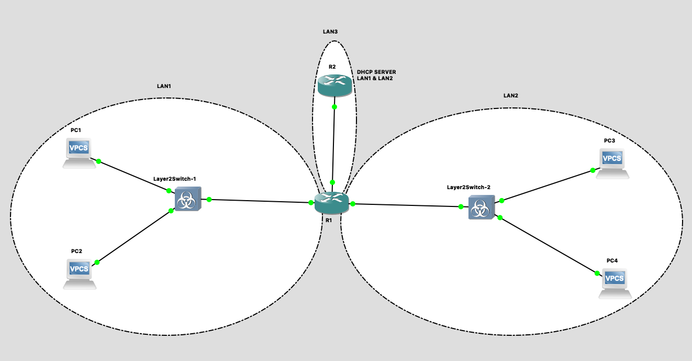
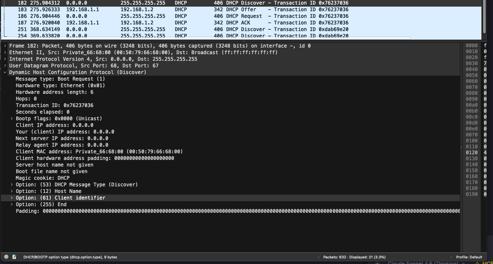
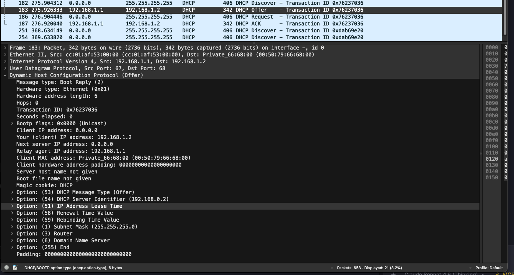
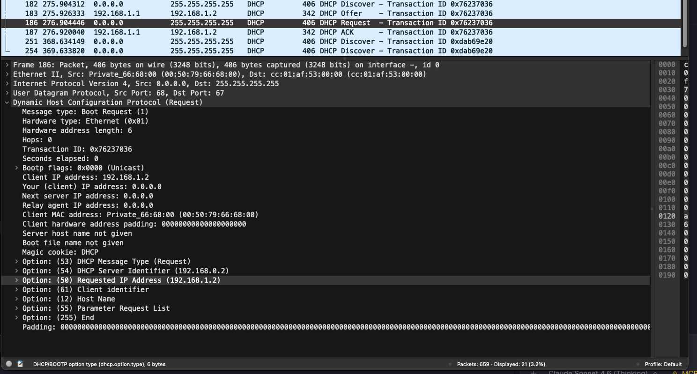
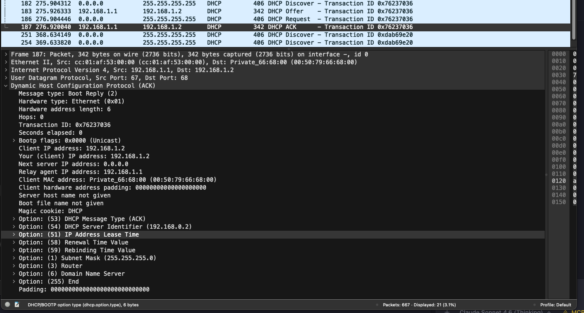

# Лабораторная работа №4: Настройка протокола DHCP

## Сикаченко Дмитрий Константинович

Топология



---

## 1. Для заданной на схеме schema-lab4 сети, состоящей из управляемых коммутаторов, маршрутизаторов и персональных компьютеров выполнить планирование и документирование адресного пространства в подсетях LAN1, LAN2, LAN3 и назначить статические адреса маршрутизаторам и динамическое конфигурирование адресов для VPC

### Таблица адресного пространства

| Подсеть | Сеть            | Маска         | Шлюз         | Устройство | Интерфейс | IP-адрес        |
|---------|-----------------|---------------|--------------|------------|-----------|-----------------|
| LAN3    | 192.168.0.0/24  | 255.255.255.0 | —            | R1         | f1/0      | 192.168.0.1     |
| LAN3    | 192.168.0.0/24  | 255.255.255.0 | —            | R2         | f0/0      | 192.168.0.2     |
| LAN1    | 192.168.1.0/24  | 255.255.255.0 | 192.168.1.1  | R1         | f0/0      | 192.168.1.1     |
| LAN1    | 192.168.1.0/24  | 255.255.255.0 | 192.168.1.1  | PC1        | —         | DHCP            |
| LAN1    | 192.168.1.0/24  | 255.255.255.0 | 192.168.1.1  | PC2        | —         | DHCP            |
| LAN2    | 192.168.2.0/24  | 255.255.255.0 | 192.168.2.1  | R1         | f2/0      | 192.168.2.1     |
| LAN2    | 192.168.2.0/24  | 255.255.255.0 | 192.168.2.1  | PC3        | —         | DHCP            |
| LAN2    | 192.168.2.0/24  | 255.255.255.0 | 192.168.2.1  | PC4        | —         | DHCP            |

### R2

```bash
R2> enable
R2# configure terminal
R2(config)# interface FastEthernet0/0
R2(config-if)# ip address 192.168.0.2 255.255.255.0
R2(config-if)# no shutdown
R2(config-if)# exit
R2(config)# exit
R2# write
```

```bash
R2# show ip interface brief

Interface              IP-Address      OK? Method Status   Protocol
FastEthernet0/0        192.168.0.2     YES manual up       up
```

### R1

```bash
R1> enable
R1# configure terminal
R1(config)# interface FastEthernet0/0
R1(config-if)# ip address 192.168.1.1 255.255.255.0
R1(config-if)# no shutdown
R1(config-if)# exit
R1(config)# interface FastEthernet1/0
R1(config-if)# ip address 192.168.0.1 255.255.255.0
R1(config-if)# no shutdown
R1(config-if)# exit
R1(config)# interface FastEthernet2/0
R1(config-if)# ip address 192.168.2.1 255.255.255.0
R1(config-if)# no shutdown
R1(config-if)# exit
R1(config)# exit
R1# write
```

```bash
R1# show ip interface brief

Interface              IP-Address      OK? Method Status   Protocol
FastEthernet0/0        192.168.1.1     YES manual up       up
FastEthernet1/0        192.168.0.1     YES manual up       up
FastEthernet2/0        192.168.2.1     YES manual up       up
```

---

## 2. Настроить сервер DHCP на маршрутизаторе R2 для обслуживания адресных пулов адресного пространства подсетей LAN1 и LAN2

```bash
R2# configure terminal
R2(config)# ip dhcp pool LAN1
R2(dhcp-config)# network 192.168.1.0 255.255.255.0
R2(dhcp-config)# default-router 192.168.1.1
R2(dhcp-config)# dns-server 8.8.8.8
R2(dhcp-config)# exit
R2(config)# ip dhcp pool LAN2
R2(dhcp-config)# network 192.168.2.0 255.255.255.0
R2(dhcp-config)# default-router 192.168.2.1
R2(dhcp-config)# dns-server 8.8.8.8
R2(dhcp-config)# exit
R2(config)# exit
R2# write
```

```bash
R2# show ip dhcp pool

Pool LAN1 :
 Utilization mark (high/low)    : 100 / 0
 Subnet size (first/next)       : 0 / 0
 Total addresses                : 254
 Leased addresses               : 0
 Pending event                  : none
 1 subnet is currently in the pool :
 Current index        IP address range                    Leased addresses
 192.168.1.1          192.168.1.1      - 192.168.1.254     0

Pool LAN2 :
 Utilization mark (high/low)    : 100 / 0
 Subnet size (first/next)       : 0 / 0
 Total addresses                : 254
 Leased addresses               : 0
 Pending event                  : none
 1 subnet is currently in the pool :
 Current index        IP address range                    Leased addresses
 192.168.2.1          192.168.2.1      - 192.168.2.254     0
```

---

## 3. Настроить статическую (nb!) маршрутизацию между подсетями

R1 имеет все три подсети напрямую (connected), поэтому статические маршруты на нём не требуются. R2 знает только LAN3, поэтому добавляем маршруты к LAN1 и LAN2 через R1.

### R2 — статические маршруты

```bash
R2# configure terminal
R2(config)# ip route 192.168.1.0 255.255.255.0 192.168.0.1
R2(config)# ip route 192.168.2.0 255.255.255.0 192.168.0.1
R2(config)# exit
R2# write
```

```bash
R2# show ip route

C    192.168.0.0/24 is directly connected, FastEthernet0/0
S    192.168.1.0/24 [1/0] via 192.168.0.1
S    192.168.2.0/24 [1/0] via 192.168.0.1
```

```bash
R1# show ip route

C    192.168.0.0/24 is directly connected, FastEthernet1/0
C    192.168.1.0/24 is directly connected, FastEthernet0/0
C    192.168.2.0/24 is directly connected, FastEthernet2/0
```

### R1 — DHCP Relay

VPC отправляет DHCP Discover широковещательно. Маршрутизатор не пропускает broadcast между сегментами, поэтому без relay VPC не достучится до R2. Команда `ip helper-address` на интерфейсах R1, смотрящих в LAN1 и LAN2, перехватывает broadcast и перенаправляет его unicast-запросом напрямую на R2 (192.168.0.2).

```bash
R1# configure terminal
R1(config)# interface FastEthernet0/0
R1(config-if)# ip helper-address 192.168.0.2
R1(config-if)# exit
R1(config)# interface FastEthernet2/0
R1(config-if)# ip helper-address 192.168.0.2
R1(config-if)# exit
R1(config)# exit
R1# write
```

```bash
R1# show running-config interface FastEthernet0/0

Building configuration...

Current configuration : 113 bytes
!
interface FastEthernet0/0
 ip address 192.168.1.1 255.255.255.0
 ip helper-address 192.168.0.2
 duplex auto
 speed auto
end

R1# show running-config interface FastEthernet2/0

Building configuration...

Current configuration : 113 bytes
!
interface FastEthernet2/0
 ip address 192.168.2.1 255.255.255.0
 ip helper-address 192.168.0.2
 duplex auto
 speed auto
end
```

---

## 4. Проверить работоспособность протокола DHCP и маршрутизации, выполнив ping между всеми VPC

### Получение адресов по DHCP

```bash
PC1> ip dhcp
DDORA IP 192.168.1.2/24 GW 192.168.1.1

PC2> ip dhcp
DDORA IP 192.168.1.3/24 GW 192.168.1.1

PC3> ip dhcp
DDORA IP 192.168.2.2/24 GW 192.168.2.1

PC4> ip dhcp
DDORA IP 192.168.2.3/24 GW 192.168.2.1
```

### Ping

```bash
PC1> ping 192.168.1.3

84 bytes from 192.168.1.3 icmp_seq=1 ttl=64 time=13.841 ms
84 bytes from 192.168.1.3 icmp_seq=2 ttl=64 time=0.874 ms
```

```bash
PC1> ping 192.168.2.2

84 bytes from 192.168.2.2 icmp_seq=1 ttl=63 time=27.265 ms
84 bytes from 192.168.2.2 icmp_seq=2 ttl=63 time=13.323 ms
84 bytes from 192.168.2.2 icmp_seq=3 ttl=63 time=15.017 ms
84 bytes from 192.168.2.2 icmp_seq=4 ttl=63 time=16.420 ms
```

```bash
PC1> ping 192.168.2.3

84 bytes from 192.168.2.3 icmp_seq=1 ttl=63 time=26.364 ms
84 bytes from 192.168.2.3 icmp_seq=2 ttl=63 time=23.301 ms
84 bytes from 192.168.2.3 icmp_seq=3 ttl=63 time=22.011 ms
84 bytes from 192.168.2.3 icmp_seq=4 ttl=63 time=12.621 ms
```

```bash
PC2> ping 192.168.2.2

84 bytes from 192.168.2.2 icmp_seq=1 ttl=63 time=28.812 ms
```

```bash
PC2> ping 192.168.2.3

84 bytes from 192.168.2.3 icmp_seq=1 ttl=63 time=18.232 ms
84 bytes from 192.168.2.3 icmp_seq=2 ttl=63 time=33.151 ms
```

```bash
PC3> ping 192.168.2.3

84 bytes from 192.168.2.3 icmp_seq=1 ttl=64 time=1.944 ms
```

---

## 5. Перехватить в Wireshark диалог одного из VPC с сервером DHCP, разобрать с комментариями

Capture link PC1_Ethernet0_to_Layer2Switch-1_Ethernet0

### Разбор DHCP-диалога (DORA)

#### 1. DHCP Discover



Клиент (PC1) не имеет IP-адреса. Отправляет широковещательный запрос в поисках DHCP-сервера.

```bash
Bootstrap Protocol (Discover)
    Message type: Boot Request (1)
    Client IP address: 0.0.0.0
    Your (client) IP address: 0.0.0.0
    DHCP Message Type: Discover (1)
    Client MAC address: 00:50:79:66:68:00
    Transaction ID: 0x76237036
```

- Source IP: `0.0.0.0` — клиент ещё не имеет адреса.
- Destination IP: `255.255.255.255` — broadcast, адресован всем устройствам в сегменте.
- Source MAC: MAC PC1. Destination MAC: `ff:ff:ff:ff:ff:ff`.
- Transaction ID: уникальный идентификатор сессии, связывающий все 4 пакета диалога.

Broadcast не маршрутизируется. R1 перехватывает пакет на f0/0 и благодаря `ip helper-address 192.168.0.2` пересылает его unicast-запросом напрямую на R2.

#### 2. DHCP Offer



Сервер R2 (`192.168.0.2`) предлагает IP-адрес клиенту.

```bash
Bootstrap Protocol (Offer)
    Message type: Boot Reply (2)
    Your (client) IP address: 192.168.1.2
    DHCP Message Type: Offer (2)
    Subnet Mask: 255.255.255.0
    Router: 192.168.1.1
    Domain Name Server: 8.8.8.8
    IP Address Lease Time: 1 day
    Transaction ID: 0x76237036
```

- Предлагаемый IP: `192.168.1.2`, маска: `255.255.255.0`, шлюз: `192.168.1.1`.
- Transaction ID совпадает с Discover.
- Сервер резервирует адрес, но не назначает окончательно — клиент должен подтвердить.

#### 3. DHCP Request



Клиент подтверждает принятие предложенного IP. Снова broadcast — чтобы уведомить все DHCP-серверы в сети о выборе.

```bash
Bootstrap Protocol (Request)
    Message type: Boot Request (1)
    Client IP address: 0.0.0.0
    DHCP Message Type: Request (3)
    Requested IP Address: 192.168.1.2
    Server Identifier: 192.168.0.2
    Transaction ID: 0x76237036
```

#### 4. DHCP Ack



Сервер подтверждает выдачу адреса. После этого клиент считается настроенным.

```bash
Bootstrap Protocol (ACK)
    Message type: Boot Reply (2)
    Your (client) IP address: 192.168.1.2
    DHCP Message Type: ACK (5)
    Subnet Mask: 255.255.255.0
    Router: 192.168.1.1
    Domain Name Server: 8.8.8.8
    IP Address Lease Time: 1 day
    Transaction ID: 0x76237036
```

### Выводы

DORA-процесс: Discover → Offer → Request → Ack.

Discover и Request отправляются broadcast (`255.255.255.255` / `ff:ff:ff:ff:ff:ff`), так как клиент не знает адреса сервера. Offer и Ack — unicast от сервера к клиенту.

Transaction ID связывает все 4 пакета одной сессии для корректного сопоставления запросов и ответов.

DHCP Relay (`ip helper-address`) необходим, поскольку broadcast не маршрутизируется: без него Discover не достиг бы R2.

---

## 6. Сохранить файлы конфигураций устройств в виде набора файлов с именами, соответствующими именам устройств

```bash
enable
show running-config
```

Файлы конфигураций сохранены в ./configs

---
