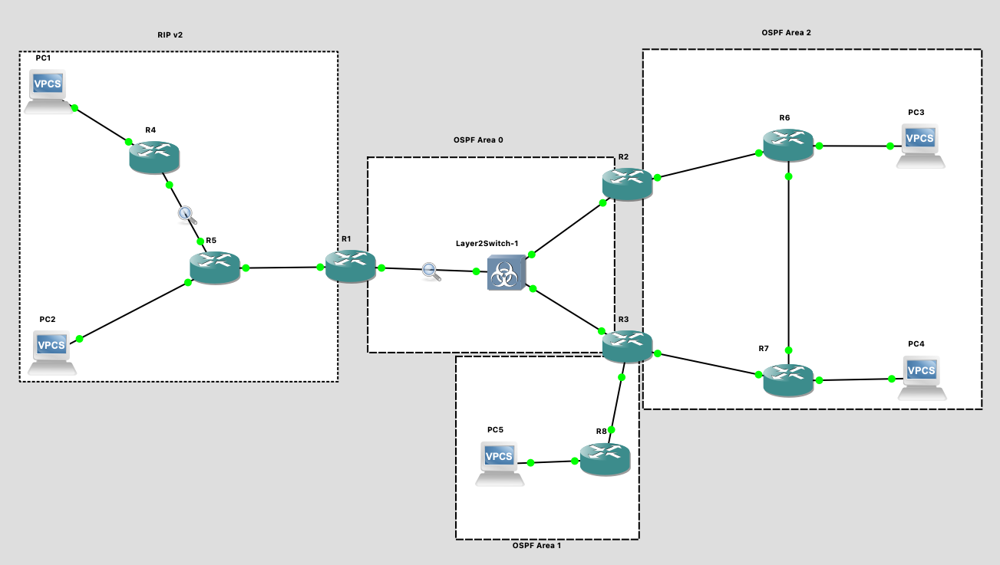
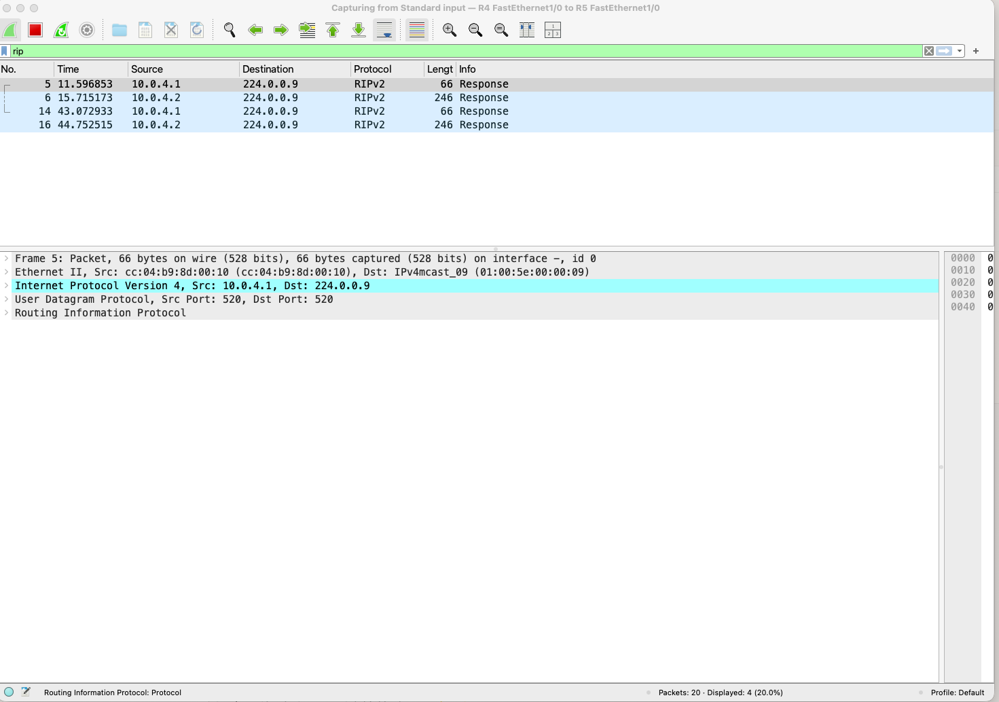
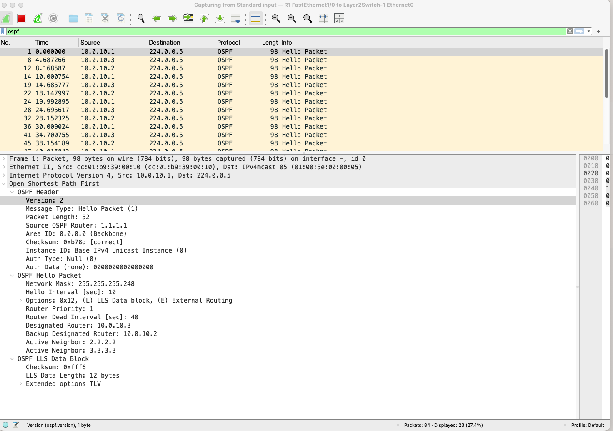

# Лабораторная работа №5: Настройка протоколов динамической маршрутизации RIP v2 и OSPF

## Сикаченко Дмитрий Константинович

Топология



---

## 1. Для заданной на схеме schema-lab5 сети, состоящей из управляемых коммутаторов, маршрутизаторов и персональных компьютеров выполнить планирование и документирование адресного пространства и назначить статические адреса всем устройствам

nb! Каждое соединение маршрутизатора с маршрутизатором — это отдельная сеть (`/30`). Сети LAN (маршрутизатор↔PC) — `/24`.

### Таблица адресного пространства

| Устройство | Интерфейс | Сеть            | IP-адрес    | Маска             | Шлюз        | Куда подключён   |
|------------|-----------|-----------------|-------------|-------------------|-------------|------------------|
| PC1        | e0        | 192.168.1.0/24  | 192.168.1.2 | 255.255.255.0     | 192.168.1.1 | R4 f0/0          |
| PC2        | e0        | 192.168.2.0/24  | 192.168.2.2 | 255.255.255.0     | 192.168.2.1 | R5 f0/0          |
| PC3        | e0        | 192.168.3.0/24  | 192.168.3.2 | 255.255.255.0     | 192.168.3.1 | R6 f1/0          |
| PC4        | e0        | 192.168.4.0/24  | 192.168.4.2 | 255.255.255.0     | 192.168.4.1 | R7 f1/0          |
| PC5        | e0        | 192.168.5.0/24  | 192.168.5.2 | 255.255.255.0     | 192.168.5.1 | R8 f1/0          |
| R1         | f0/0      | 10.0.0.0/30     | 10.0.0.1    | 255.255.255.252   | —           | R5 f2/0          |
| R1         | f1/0      | 10.0.10.0/30    | 10.0.10.1   | 255.255.255.252   | —           | L2Switch e0      |
| R2         | f0/0      | 10.0.10.4/30    | 10.0.10.5   | 255.255.255.252   | —           | L2Switch e1      |
| R2         | f1/0      | 10.0.1.0/30     | 10.0.1.1    | 255.255.255.252   | —           | R6 f0/0          |
| R3         | f0/0      | 10.0.10.8/30    | 10.0.10.9   | 255.255.255.252   | —           | L2Switch e2      |
| R3         | f1/0      | 10.0.2.0/30     | 10.0.2.1    | 255.255.255.252   | —           | R7 f0/0          |
| R3         | f2/0      | 10.0.3.0/30     | 10.0.3.1    | 255.255.255.252   | —           | R8 f0/0          |
| R4         | f0/0      | 192.168.1.0/24  | 192.168.1.1 | 255.255.255.0     | —           | PC1              |
| R4         | f1/0      | 10.0.4.0/30     | 10.0.4.1    | 255.255.255.252   | —           | R5 f1/0          |
| R5         | f0/0      | 192.168.2.0/24  | 192.168.2.1 | 255.255.255.0     | —           | PC2              |
| R5         | f1/0      | 10.0.4.0/30     | 10.0.4.2    | 255.255.255.252   | —           | R4 f1/0          |
| R5         | f2/0      | 10.0.0.0/30     | 10.0.0.2    | 255.255.255.252   | —           | R1 f0/0          |
| R6         | f0/0      | 10.0.1.0/30     | 10.0.1.2    | 255.255.255.252   | —           | R2 f1/0          |
| R6         | f1/0      | 192.168.3.0/24  | 192.168.3.1 | 255.255.255.0     | —           | PC3              |
| R6         | f2/0      | 10.0.5.0/30     | 10.0.5.1    | 255.255.255.252   | —           | R7 f2/0          |
| R7         | f0/0      | 10.0.2.0/30     | 10.0.2.2    | 255.255.255.252   | —           | R3 f1/0          |
| R7         | f1/0      | 192.168.4.0/24  | 192.168.4.1 | 255.255.255.0     | —           | PC4              |
| R7         | f2/0      | 10.0.5.0/30     | 10.0.5.2    | 255.255.255.252   | —           | R6 f2/0          |
| R8         | f0/0      | 10.0.3.0/30     | 10.0.3.2    | 255.255.255.252   | —           | R3 f2/0          |
| R8         | f1/0      | 192.168.5.0/24  | 192.168.5.1 | 255.255.255.0     | —           | PC5              |

### Настройка статических адресов

```bash
# PC1
ip 192.168.1.2 255.255.255.0 192.168.1.1
save

# PC2
ip 192.168.2.2 255.255.255.0 192.168.2.1
save

# PC3
ip 192.168.3.2 255.255.255.0 192.168.3.1
save

# PC4
ip 192.168.4.2 255.255.255.0 192.168.4.1
save

# PC5
ip 192.168.5.2 255.255.255.0 192.168.5.1
save
```

```bash
R1(config)# interface f0/0
R1(config-if)# ip address 10.0.0.1 255.255.255.252
R1(config-if)# no shutdown
R1(config-if)# exit
R1(config)# interface f1/0
R1(config-if)# ip address 10.0.10.1 255.255.255.252
R1(config-if)# no shutdown
R1(config-if)# exit
R1(config)# exit
R1# write
```

```bash
R2(config)# interface f0/0
R2(config-if)# ip address 10.0.10.5 255.255.255.252
R2(config-if)# no shutdown
R2(config-if)# exit
R2(config)# interface f1/0
R2(config-if)# ip address 10.0.1.1 255.255.255.252
R2(config-if)# no shutdown
R2(config-if)# exit
R2(config)# exit
R2# write
```

```bash
R3(config)# interface f0/0
R3(config-if)# ip address 10.0.10.9 255.255.255.252
R3(config-if)# no shutdown
R3(config-if)# exit
R3(config)# interface f1/0
R3(config-if)# ip address 10.0.2.1 255.255.255.252
R3(config-if)# no shutdown
R3(config-if)# exit
R3(config)# interface f2/0
R3(config-if)# ip address 10.0.3.1 255.255.255.252
R3(config-if)# no shutdown
R3(config-if)# exit
R3(config)# exit
R3# write
```

```bash
R4(config)# interface f0/0
R4(config-if)# ip address 192.168.1.1 255.255.255.0
R4(config-if)# no shutdown
R4(config-if)# exit
R4(config)# interface f1/0
R4(config-if)# ip address 10.0.4.1 255.255.255.252
R4(config-if)# no shutdown
R4(config-if)# exit
R4(config)# exit
R4# write
```

```bash
R5(config)# interface f0/0
R5(config-if)# ip address 192.168.2.1 255.255.255.0
R5(config-if)# no shutdown
R5(config-if)# exit
R5(config)# interface f1/0
R5(config-if)# ip address 10.0.4.2 255.255.255.252
R5(config-if)# no shutdown
R5(config-if)# exit
R5(config)# interface f2/0
R5(config-if)# ip address 10.0.0.2 255.255.255.252
R5(config-if)# no shutdown
R5(config-if)# exit
R5(config)# exit
R5# write
```

```bash
R6(config)# interface f0/0
R6(config-if)# ip address 10.0.1.2 255.255.255.252
R6(config-if)# no shutdown
R6(config-if)# exit
R6(config)# interface f1/0
R6(config-if)# ip address 192.168.3.1 255.255.255.0
R6(config-if)# no shutdown
R6(config-if)# exit
R6(config)# interface f2/0
R6(config-if)# ip address 10.0.5.1 255.255.255.252
R6(config-if)# no shutdown
R6(config-if)# exit
R6(config)# exit
R6# write
```

```bash
R7(config)# interface f0/0
R7(config-if)# ip address 10.0.2.2 255.255.255.252
R7(config-if)# no shutdown
R7(config-if)# exit
R7(config)# interface f1/0
R7(config-if)# ip address 192.168.4.1 255.255.255.0
R7(config-if)# no shutdown
R7(config-if)# exit
R7(config)# interface f2/0
R7(config-if)# ip address 10.0.5.2 255.255.255.252
R7(config-if)# no shutdown
R7(config-if)# exit
R7(config)# exit
R7# write
```

```bash
R8(config)# interface f0/0
R8(config-if)# ip address 10.0.3.2 255.255.255.252
R8(config-if)# no shutdown
R8(config-if)# exit
R8(config)# interface f1/0
R8(config-if)# ip address 192.168.5.1 255.255.255.0
R8(config-if)# no shutdown
R8(config-if)# exit
R8(config)# exit
R8# write
```

### Проверка (R1, пограничный маршрутизатор RIP/OSPF)

```bash
R1# show ip interface brief

Interface              IP-Address       OK? Method Status   Protocol
FastEthernet0/0         10.0.0.1         YES manual up       up
FastEthernet1/0         10.0.10.1        YES manual up       up
```

---

## 2. Настроить протокол динамической маршрутизации RIP v2 для области, указанной на схеме schema-lab5

RIP v2 работает в сегменте **PC1 — R4 — R5 — R1**. R1 — граница RIP/OSPF, поэтому в RIP анонсирует только линк к R5.

### R4

```bash
R4(config)# router rip
R4(config-router)# version 2
R4(config-router)# network 192.168.1.0
R4(config-router)# network 10.0.4.0
R4(config-router)# no auto-summary
R4(config-router)# exit
R4# write
```

### R5

```bash
R5(config)# router rip
R5(config-router)# version 2
R5(config-router)# network 192.168.2.0
R5(config-router)# network 10.0.4.0
R5(config-router)# network 10.0.0.0
R5(config-router)# no auto-summary
R5(config-router)# exit
R5# write
```

### R1 (только линк к R5)

```bash
R1(config)# router rip
R1(config-router)# version 2
R1(config-router)# network 10.0.0.0
R1(config-router)# no auto-summary
R1(config-router)# exit
R1# write
```

### Проверка

```bash
R5# show ip rip database

192.168.1.0/24    auto-summary
   [1] via 10.0.4.1, 00:00:12, FastEthernet1/0
```

`no auto-summary` обязателен, иначе RIP свернёт `/24`-сети до classful границ, и `/30`-линки между маршрутизаторами потеряют маску при передаче.

---

## 3. Настроить протокол динамической маршрутизации OSPF для зон 0, 1, 2. Зону 1 настроить как полностью (nb!) тупиковую

Схема зон:

- **Area 0** (backbone): R1 — L2Switch — R2, R3
- **Area 2**: R2 — R6 — PC3, R3 — R7 — PC4 (R6 и R7 связаны кольцом)
- **Area 1** (Totally Stubby): R3 — R8 — PC5

ABR: R1 (граница RIP/Area 0), R2 (Area 0 + Area 2), R3 (Area 0 + Area 1 + Area 2).

### R1

```bash
R1(config)# router ospf 1
R1(config-router)# router-id 1.1.1.1
R1(config-router)# network 10.0.10.0 0.0.0.3 area 0
R1(config-router)# exit
R1# write
```

### R2 (ABR: Area 0 + Area 2)

```bash
R2(config)# router ospf 1
R2(config-router)# router-id 2.2.2.2
R2(config-router)# network 10.0.10.4 0.0.0.3 area 0
R2(config-router)# network 10.0.1.0 0.0.0.3 area 2
R2(config-router)# exit
R2# write
```

### R3 (ABR: Area 0 + Area 1 + Area 2)

```bash
R3(config)# router ospf 1
R3(config-router)# router-id 3.3.3.3
R3(config-router)# network 10.0.10.8 0.0.0.3 area 0
R3(config-router)# network 10.0.2.0 0.0.0.3 area 2
R3(config-router)# network 10.0.3.0 0.0.0.3 area 1
R3(config-router)# area 1 stub no-summary
R3(config-router)# exit
R3# write
```

nb! `no-summary` указывается **только на ABR** (R3) — именно эта команда превращает обычную stub-зону в Totally Stubby: внутренние маршрутизаторы зоны не получают ни внешних (E), ни межзонных (IA) маршрутов, только маршрут по умолчанию.

### R6 (внутри Area 2)

```bash
R6(config)# router ospf 1
R6(config-router)# router-id 6.6.6.6
R6(config-router)# network 10.0.1.0 0.0.0.3 area 2
R6(config-router)# network 192.168.3.0 0.0.0.255 area 2
R6(config-router)# network 10.0.5.0 0.0.0.3 area 2
R6(config-router)# exit
R6# write
```

### R7 (внутри Area 2)

```bash
R7(config)# router ospf 1
R7(config-router)# router-id 7.7.7.7
R7(config-router)# network 10.0.2.0 0.0.0.3 area 2
R7(config-router)# network 192.168.4.0 0.0.0.255 area 2
R7(config-router)# network 10.0.5.0 0.0.0.3 area 2
R7(config-router)# exit
R7# write
```

### R8 (внутри Area 1, Totally Stubby)

```bash
R8(config)# router ospf 1
R8(config-router)# router-id 8.8.8.8
R8(config-router)# network 10.0.3.0 0.0.0.3 area 1
R8(config-router)# network 192.168.5.0 0.0.0.255 area 1
R8(config-router)# area 1 stub
R8(config-router)# exit
R8# write
```

nb! На R8 команда `area 1 stub` — **без** `no-summary`. Если добавить `no-summary` на внутреннем маршрутизаторе (не ABR), команда будет отклонена или не даст эффекта — фильтрация summary-маршрутов выполняется именно на границе зоны.

### Проверка

```bash
R1# show ip ospf neighbor

Neighbor ID     Pri   State           Dead Time   Address         Interface
2.2.2.2         1     FULL/DR         00:00:32    10.0.10.5       FastEthernet1/0
3.3.3.3         1     FULL/BDR        00:00:38    10.0.10.9       FastEthernet1/0
```

```bash
R8# show ip route ospf

O*IA  0.0.0.0/0 [110/2] via 10.0.3.1, FastEthernet0/0
```

На R8 в таблице маршрутизации — единственный маршрут по умолчанию `O*IA` от R3, что подтверждает корректную работу Totally Stubby area.

---

## 4. Настроить редистрибуцию маршрутов между протоколами RIP v2 и OSPF

Редистрибуция настраивается только на R1 — единственном маршрутизаторе, работающем одновременно в RIP и OSPF.

```bash
R1(config)# router ospf 1
R1(config-router)# redistribute rip subnets metric 20
R1(config-router)# exit
R1(config)# router rip
R1(config-router)# redistribute ospf 1 metric 5
R1(config-router)# exit
R1(config)# exit
R1# write
```

- `redistribute rip subnets metric 20` — импорт маршрутов RIP в OSPF как внешние типа E2 с метрикой 20. Ключевое слово `subnets` обязательно, иначе в OSPF попадут только classful-сети, а `/30`- и `/24`-подсети RIP-области потеряются.
- `redistribute ospf 1 metric 5` — импорт маршрутов OSPF в RIP с метрикой 5 хопов (диапазон RIP 1–15, 16 = недостижимо).

### Проверка

```bash
R4# show ip route rip

R    192.168.3.0/24 [120/5] via 10.0.4.2, 00:00:20, FastEthernet1/0
R    192.168.4.0/24 [120/5] via 10.0.4.2, 00:00:20, FastEthernet1/0
R    192.168.5.0/24 [120/5] via 10.0.4.2, 00:00:20, FastEthernet1/0
```

На R4 (RIP-область) появились маршруты до сетей OSPF-области с метрикой 5 — редистрибуция работает в обе стороны.

---

## 5. Проверить работоспособность маршрутизации, выполнив ping VPC «все между всеми» (nb!: в обе стороны)

### С PC1 (192.168.1.2)

```bash
PC1> ping 192.168.2.2 -c 3

192.168.2.2 icmp_seq=1 timeout
84 bytes from 192.168.2.2 icmp_seq=2 ttl=62 time=23.313 ms
^C
PC1> ping 192.168.2.2 -c 3

84 bytes from 192.168.2.2 icmp_seq=1 ttl=62 time=27.642 ms
84 bytes from 192.168.2.2 icmp_seq=2 ttl=62 time=24.365 ms
84 bytes from 192.168.2.2 icmp_seq=3 ttl=62 time=22.865 ms

PC1> ping 192.168.3.2 -c 3

192.168.3.2 icmp_seq=1 timeout
84 bytes from 192.168.3.2 icmp_seq=2 ttl=59 time=63.767 ms
84 bytes from 192.168.3.2 icmp_seq=3 ttl=59 time=62.375 ms

PC1> ping 192.168.4.2 -c 3

192.168.4.2 icmp_seq=1 timeout
84 bytes from 192.168.4.2 icmp_seq=2 ttl=59 time=57.242 ms
84 bytes from 192.168.4.2 icmp_seq=3 ttl=59 time=61.148 ms

PC1> ping 192.168.5.2 -c 3

192.168.5.2 icmp_seq=1 timeout
84 bytes from 192.168.5.2 icmp_seq=2 ttl=59 time=68.183 ms
84 bytes from 192.168.5.2 icmp_seq=3 ttl=59 time=57.683 ms
```

Первый пакет в каждой новой паре теряется — VPC выполняет ARP-запрос перед первой отправкой, и этот ICMP echo не дожидается разрешения MAC-адреса. Со второго пакета ttl стабилен, что подтверждает установившийся маршрут.

### С PC2 (192.168.2.2)

```bash
PC2> ping 192.168.1.2 -c 3

84 bytes from 192.168.1.2 icmp_seq=1 ttl=62 time=35.938 ms
84 bytes from 192.168.1.2 icmp_seq=2 ttl=62 time=32.537 ms
84 bytes from 192.168.1.2 icmp_seq=3 ttl=62 time=26.905 ms

PC2> ping 192.168.3.2 -c 3

84 bytes from 192.168.3.2 icmp_seq=1 ttl=60 time=57.003 ms
84 bytes from 192.168.3.2 icmp_seq=2 ttl=60 time=42.500 ms
84 bytes from 192.168.3.2 icmp_seq=3 ttl=60 time=55.970 ms

PC2> ping 192.168.4.2 -c 3

84 bytes from 192.168.4.2 icmp_seq=1 ttl=60 time=64.220 ms
84 bytes from 192.168.4.2 icmp_seq=2 ttl=60 time=50.187 ms
84 bytes from 192.168.4.2 icmp_seq=3 ttl=60 time=53.680 ms

PC2> ping 192.168.5.2 -c 3

84 bytes from 192.168.5.2 icmp_seq=1 ttl=60 time=52.499 ms
84 bytes from 192.168.5.2 icmp_seq=2 ttl=60 time=52.611 ms
84 bytes from 192.168.5.2 icmp_seq=3 ttl=60 time=47.477 ms
```

### С PC3 (192.168.3.2)

```bash
PC3> ping 192.168.1.2 -c 3

84 bytes from 192.168.1.2 icmp_seq=1 ttl=59 time=55.175 ms
84 bytes from 192.168.1.2 icmp_seq=2 ttl=59 time=64.066 ms
84 bytes from 192.168.1.2 icmp_seq=3 ttl=59 time=64.614 ms

PC3> ping 192.168.2.2 -c 3

84 bytes from 192.168.2.2 icmp_seq=1 ttl=60 time=57.215 ms
84 bytes from 192.168.2.2 icmp_seq=2 ttl=60 time=64.765 ms
84 bytes from 192.168.2.2 icmp_seq=3 ttl=60 time=53.857 ms

PC3> ping 192.168.4.2 -c 3

84 bytes from 192.168.4.2 icmp_seq=1 ttl=62 time=25.440 ms
84 bytes from 192.168.4.2 icmp_seq=2 ttl=62 time=30.493 ms
84 bytes from 192.168.4.2 icmp_seq=3 ttl=62 time=34.514 ms

PC3> ping 192.168.5.2 -c 3

84 bytes from 192.168.5.2 icmp_seq=1 ttl=60 time=42.387 ms
84 bytes from 192.168.5.2 icmp_seq=2 ttl=60 time=56.050 ms
84 bytes from 192.168.5.2 icmp_seq=3 ttl=60 time=44.086 ms
```

### С PC4 (192.168.4.2)

```bash
PC4> ping 192.168.1.2 -c 3

84 bytes from 192.168.1.2 icmp_seq=1 ttl=59 time=82.963 ms
84 bytes from 192.168.1.2 icmp_seq=2 ttl=59 time=65.457 ms
84 bytes from 192.168.1.2 icmp_seq=3 ttl=59 time=72.980 ms

PC4> ping 192.168.2.2 -c 3

84 bytes from 192.168.2.2 icmp_seq=1 ttl=60 time=58.157 ms
84 bytes from 192.168.2.2 icmp_seq=2 ttl=60 time=41.957 ms
84 bytes from 192.168.2.2 icmp_seq=3 ttl=60 time=52.805 ms

PC4> ping 192.168.3.2 -c 3

84 bytes from 192.168.3.2 icmp_seq=1 ttl=62 time=26.494 ms
84 bytes from 192.168.3.2 icmp_seq=2 ttl=62 time=23.029 ms
84 bytes from 192.168.3.2 icmp_seq=3 ttl=62 time=22.871 ms

PC4> ping 192.168.5.2 -c 3

84 bytes from 192.168.5.2 icmp_seq=1 ttl=61 time=39.728 ms
84 bytes from 192.168.5.2 icmp_seq=2 ttl=61 time=44.034 ms
84 bytes from 192.168.5.2 icmp_seq=3 ttl=61 time=41.001 ms
```

### С PC5 (192.168.5.2)

```bash
PC5> ping 192.168.1.2 -c 3

84 bytes from 192.168.1.2 icmp_seq=1 ttl=59 time=74.600 ms
84 bytes from 192.168.1.2 icmp_seq=2 ttl=59 time=52.871 ms
84 bytes from 192.168.1.2 icmp_seq=3 ttl=59 time=54.704 ms

PC5> ping 192.168.2.2 -c 3

84 bytes from 192.168.2.2 icmp_seq=1 ttl=60 time=50.244 ms
84 bytes from 192.168.2.2 icmp_seq=2 ttl=60 time=54.718 ms
84 bytes from 192.168.2.2 icmp_seq=3 ttl=60 time=54.327 ms

PC5> ping 192.168.3.2 -c 3

84 bytes from 192.168.3.2 icmp_seq=1 ttl=60 time=47.241 ms
84 bytes from 192.168.3.2 icmp_seq=2 ttl=60 time=42.401 ms
84 bytes from 192.168.3.2 icmp_seq=3 ttl=60 time=43.481 ms

PC5> ping 192.168.4.2 -c 3

84 bytes from 192.168.4.2 icmp_seq=1 ttl=61 time=37.362 ms
84 bytes from 192.168.4.2 icmp_seq=2 ttl=61 time=43.064 ms
84 bytes from 192.168.4.2 icmp_seq=3 ttl=61 time=36.030 ms
```

Все 5 VPC пропинговали друг друга во всех парах (10 пар, каждая проверена с обеих сторон) — RIP, OSPF и редистрибуция между ними работают корректно на всём протяжении сети.

---

## 6. Перехватить в wireshark сообщения протоколов RIP v2 и OSPF, идентифицировать их тип и содержание

### RIP v2 — линк R4 f1/0 ↔ R5 f1/0



- Протокол: `RIP`, тип пакета: `Response` — периодическая рассылка таблицы маршрутов (по умолчанию раз в 30 сек).
- Destination IP: `224.0.0.9` — групповой адрес All RIP-2 Routers (RIP v1 рассылал бы `255.255.255.255` broadcast; переход на multicast — одно из отличий v2 от v1).
- UDP порт назначения: `520`.
- В теле пакета — список анонсируемых сетей с масками (в RIP v1 маски в пакете нет — это второе ключевое отличие v2) и метрикой (hop count).
- С линка R4↔R5 видно, как R5 анонсирует R4 сеть `192.168.2.0/24` (своя LAN) и — после настройки редистрибуции на R1 — сети OSPF-области с метрикой `5`.

### OSPF — линк R1 f1/0 ↔ L2Switch (Area 0)



- Протокол: `OSPF`, тип пакета: `Hello` (OSPF-пакет типа 1) — механизм поддержания соседства, рассылается раз в 10 сек (Hello Interval), Dead Interval — 40 сек.
- Destination IP: `224.0.0.5` — All OSPF Routers.
- Router ID отправителя (R1) — `1.1.1.1`, Area ID — `0.0.0.0` (backbone), что соответствует конфигурации `network 10.0.10.0 0.0.0.3 area 0`.
- В поле Hello — список уже известных соседей (Neighbor), Network Mask линка, Router/Backup Designated Router (в multiaccess-сегментах OSPF выбирает DR/BDR — на broadcast-линке через L2Switch эти поля заполнены).

---

## 7. Сохранить в отдельные файлы с префиксом rt_ и именем маршрутизатора таблицы маршрутизации всех маршрутизаторов

На каждом маршрутизаторе выполнена команда:

```bash
show ip route
```

Вывод сохранён в файлы: `rt_R1.txt`, `rt_R2.txt`, `rt_R3.txt`, `rt_R4.txt`, `rt_R5.txt`, `rt_R6.txt`, `rt_R7.txt`, `rt_R8.txt` (каталог `./configs`).

---

## 8. Сохранить файлы конфигураций устройств в виде набора файлов с именами, соответствующими именам устройств

На каждом маршрутизаторе выполнено:

```bash
enable
show running-config
```

Все файлы — в каталоге `./configs`.
