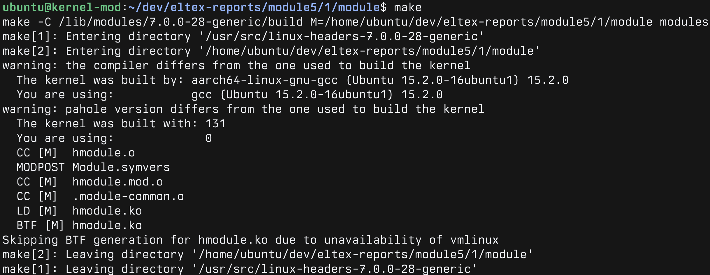
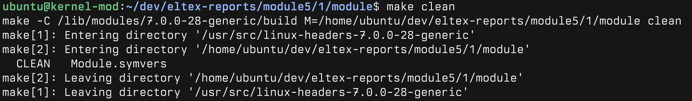

# Задание №1

## Сикаченко Дмитрий Константинович

## 1. Установка необходимых заголовков

```bash
sudo apt install -y build-essential linux-headers-$(uname -r)
```

---

## 2. Сборка модуля ядра

```bash
make

make -C /lib/modules/7.0.0-28-generic/build M=/home/ubuntu/dev/eltex-reports/module5/1/module modules
make[1]: Entering directory '/usr/src/linux-headers-7.0.0-28-generic'
make[2]: Entering directory '/home/ubuntu/dev/eltex-reports/module5/1/module'
warning: the compiler differs from the one used to build the kernel
  The kernel was built by: aarch64-linux-gnu-gcc (Ubuntu 15.2.0-16ubuntu1) 15.2.0
  You are using:           gcc (Ubuntu 15.2.0-16ubuntu1) 15.2.0
warning: pahole version differs from the one used to build the kernel
  The kernel was built with: 131
  You are using:             0
  CC [M]  hmodule.o
  MODPOST Module.symvers
  CC [M]  hmodule.mod.o
  CC [M]  .module-common.o
  LD [M]  hmodule.ko
  BTF [M] hmodule.ko
Skipping BTF generation for hmodule.ko due to unavailability of vmlinux
make[2]: Leaving directory '/home/ubuntu/dev/eltex-reports/module5/1/module'
make[1]: Leaving directory '/usr/src/linux-headers-7.0.0-28-generic'
```

---



## 3. "Вживление" модуля в ядро

```bash
sudo insmod hmodule.ko
```

Проверка загрузки модуля:

```bash
sudo dmesg | tail -1

[ 1769.986988] H(hello)Module is here and ready to go! (done its job, lol)
```


---

## 4. Выгрузка модуля из ядра

```bash
sudo rmmod hmodule.ko
```

Проверка выгрузки модуля:

```bash
sudo dmesg | tail -1

[ 1793.157800] No hmodule anymore.
```


---

## 5. Время уборки!

```bash
make clean

make -C /lib/modules/7.0.0-28-generic/build M=/home/ubuntu/dev/eltex-reports/module5/1/module clean
make[1]: Entering directory '/usr/src/linux-headers-7.0.0-28-generic'
make[2]: Entering directory '/home/ubuntu/dev/eltex-reports/module5/1/module'
  CLEAN   Module.symvers
make[2]: Leaving directory '/home/ubuntu/dev/eltex-reports/module5/1/module'
make[1]: Leaving directory '/usr/src/linux-headers-7.0.0-28-generic'
```



---

## 6. Рубрика эксперименты

Что будет если убрать `void` из параметров функций?

```bash
make -C /lib/modules/7.0.0-28-generic/build M=/home/ubuntu/dev/eltex-reports/module5/1/module modules
make[1]: Entering directory '/usr/src/linux-headers-7.0.0-28-generic'
make[2]: Entering directory '/home/ubuntu/dev/eltex-reports/module5/1/module'
warning: the compiler differs from the one used to build the kernel
  The kernel was built by: aarch64-linux-gnu-gcc (Ubuntu 15.2.0-16ubuntu1) 15.2.0
  You are using:           gcc (Ubuntu 15.2.0-16ubuntu1) 15.2.0
warning: pahole version differs from the one used to build the kernel
  The kernel was built with: 131
  You are using:             0
  CC [M]  hmodule.o
hmodule.c:9:19: error: function declaration isn’t a prototype [-Werror=strict-prototypes]
    9 | static int __init hmodule_init() {
      |                   ^~~~~~~~~~~~
hmodule.c:14:20: error: function declaration isn’t a prototype [-Werror=strict-prototypes]
   14 | static void __exit hmodule_cleanup() {
      |                    ^~~~~~~~~~~~~~~
cc1: some warnings being treated as errors
make[4]: *** [/usr/src/linux-headers-7.0.0-28-generic/scripts/Makefile.build:289: hmodule.o] Error 1
make[3]: *** [/usr/src/linux-headers-7.0.0-28-generic/Makefile:2115: .] Error 2
make[2]: *** [/usr/src/linux-headers-7.0.0-28-generic/Makefile:248: __sub-make] Error 2
make[2]: Leaving directory '/home/ubuntu/dev/eltex-reports/module5/1/module'
make[1]: *** [Makefile:248: __sub-make] Error 2
make[1]: Leaving directory '/usr/src/linux-headers-7.0.0-28-generic'
make: *** [Makefile:4: all] Error 2
```

ошиб0чка!

Компилятор не знает сколько параметров принимает функция, поэтому нужно явно указать что принимается 0, ничего, пустота — `void`.